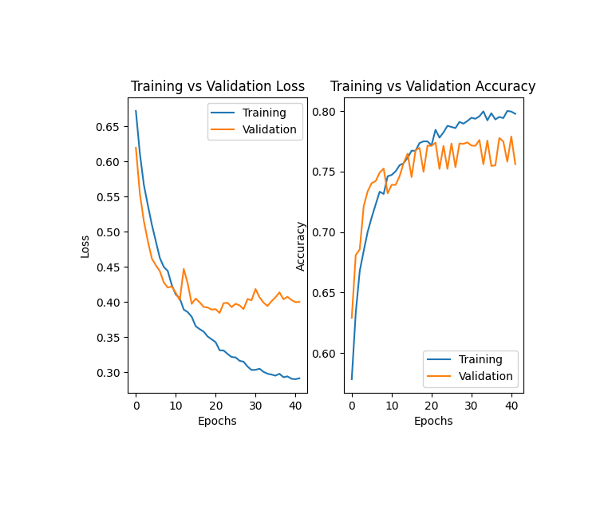

## TomTom Assignment Fake News Classification

This repository is the implementation of assignment fake news classification. 

### With Docker

run the bash script on your terminal

```
sudo bash docker_build_run_preprocess.sh
```
The train and tests file would be preprocessed

```
sudo bash docker_build_run_train_test.sh
```
Using the processed train and test files -->> Sequence Classification model would be trained and predictions made 

```
sudo bash docker_build_run_test.sh
```
Using the processed test file and trained Sequence Classification model -->> predictions made

The results will be saved in the `models` folder with corresponding model id (_TomTom_Year_Month_Day_Hour_Minute_Second_).

Four parameters can be specified in the bash script

--preprocess=1 --retrain=0 --predict=0 --prevId='TomTom_2020_11_20_15_51_32' --train='/tomtom/data/train.csv' --test='/tomtom/data/test.csv' --outpath='/tomtom/data/'
+ `preprocess`: flag variable for preprocessing
+ `retrain`: flag variable for re-training
+ `predict`: flag variable for predictions
+ `prevId`: string variable for input model id
+ `train`: file path to the training csv data
+ `test`: file path to the testing csv data
+ `outpath`: folder path for the model output

## Result

Training History


Classification Report showing Precision, Recall and f1-score for each class

| Labels/Mechanism | Precision | Recall | F1-score | Support |
|---|---|---|---|---|
|__0__|0.71|0.99|0.83|10387|
|__1__|0.99|0.59|0.74|10413|
|Accuracy|---|---|0.79|20800|
|macro avg|0.85|0.79|0.78|20800|
|weighted avg|0.85|0.79|0.78|20800|
